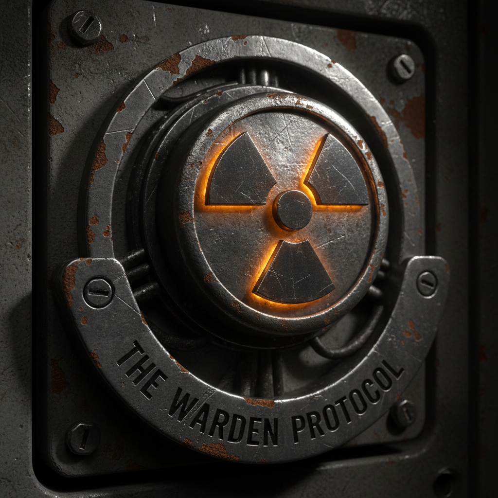
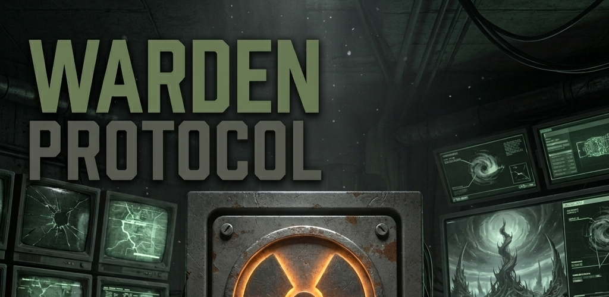
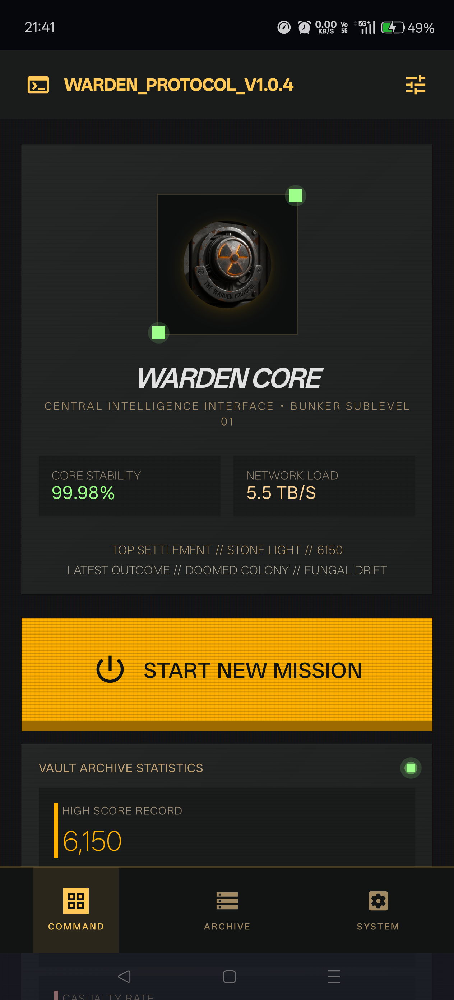
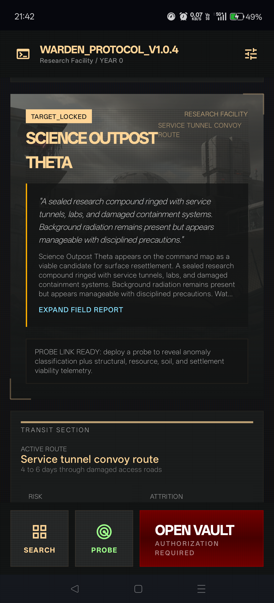
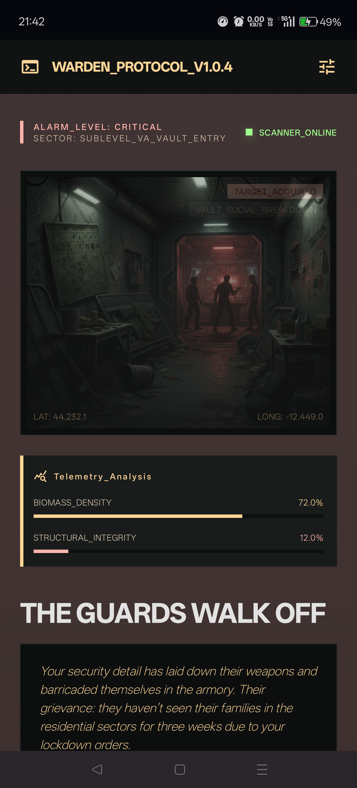
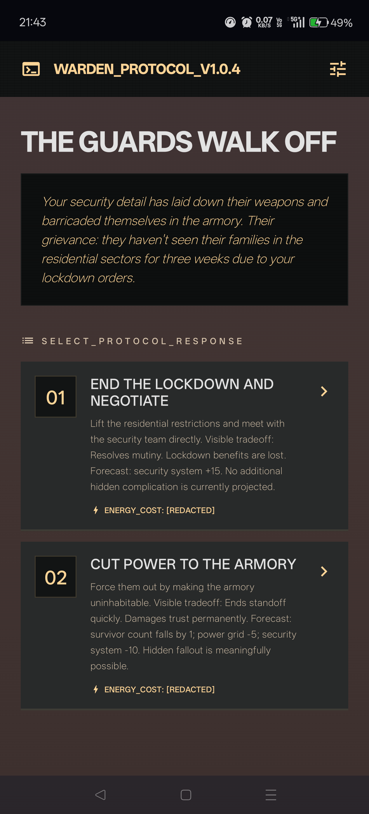
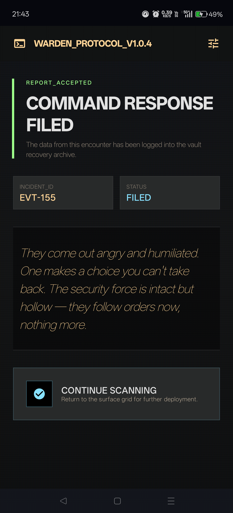
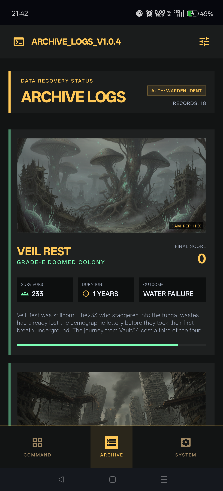
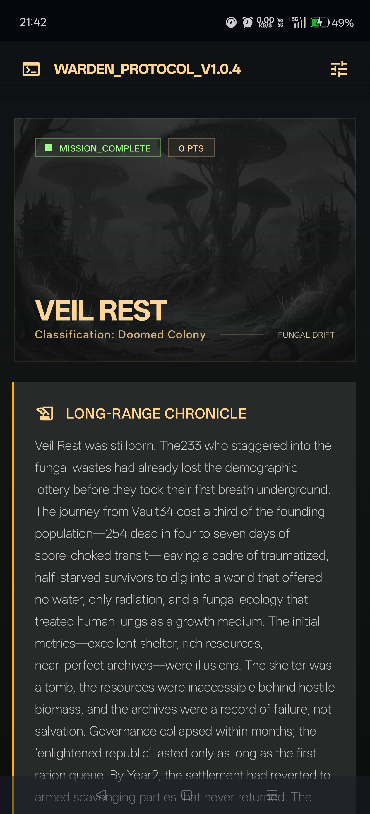
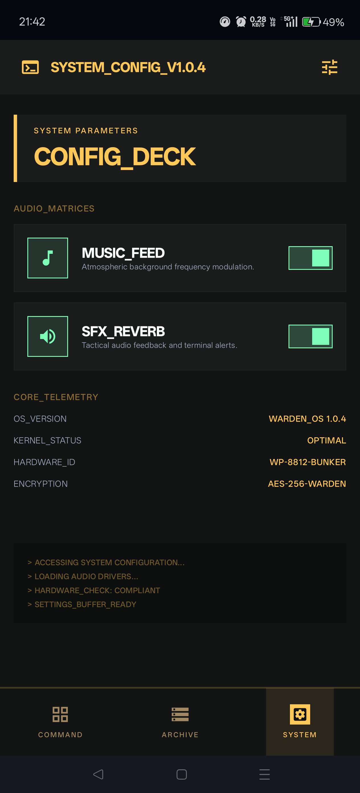

<div align="center">



<h1>The Warden Protocol</h1>

<p>
  <b>Post-Apocalyptic Vault Strategy RPG for Android</b><br>
  <i>You are the Warden. A thousand survivors depend on you.</i>
</p>

<p>
  <a href="https://github.com/abhay-byte/warden-protocol/releases/latest">
    
  </a>
  <a href="https://github.com/abhay-byte/warden-protocol/releases/latest">
    
  </a>
  
</p>

<p>
  
  
  
  
  
</p>

<br>



</div>

---

## Table of Contents

- [About](#about)
- [Screenshots](#screenshots)
- [Features](#features)
- [Gameplay](#gameplay)
- [Tech Stack](#tech-stack)
- [Architecture](#architecture)
- [Getting Started](#getting-started)
- [Project Structure](#project-structure)
- [Documentation](#documentation)
- [Contributing](#contributing)
- [License](#license)
- [Acknowledgments](#acknowledgments)

---

## About

**The Warden Protocol** is a single-player post-apocalyptic strategy game for Android where you assume the role of the Warden — an AI bunker intelligence tasked with guiding 1,000 survivors through a devastated world. Scan the radioactive surface for viable settlement locations, manage critical vault systems, resolve deadly incidents, and decide the fate of the last remnants of humanity.

Built with a distinctive **"Brutalist Relic"** aesthetic, the game immerses you in a high-contrast tactical command-console interface that feels like operating a real underground bunker terminal.

> Every run is a roguelike. No two playthroughs are ever the same.

---

## Screenshots

<div align="center">
  <table>
    <tr>
      <td width="25%"></td>
      <td width="25%"></td>
      <td width="25%"></td>
      <td width="25%"></td>
    </tr>
    <tr>
      <td align="center"><sub><b>Warden Core Hub</b></sub></td>
      <td align="center"><sub><b>Surface Scan</b></sub></td>
      <td align="center"><sub><b>Critical Event</b></sub></td>
      <td align="center"><sub><b>Protocol Response</b></sub></td>
    </tr>
    <tr>
      <td width="25%"></td>
      <td width="25%"></td>
      <td width="25%"></td>
      <td width="25%"></td>
    </tr>
    <tr>
      <td align="center"><sub><b>Command Response</b></sub></td>
      <td align="center"><sub><b>Archive Logs</b></sub></td>
      <td align="center"><sub><b>Long-Range Chronicle</b></sub></td>
      <td align="center"><sub><b>System Config</b></sub></td>
    </tr>
  </table>
</div>

---

## Features

<div align="center">

|  | Feature | Description |
|---|---|---|
| :radioactive: | **300 Surface Locations** | 16 archetypes with procedurally generated names and environmental data |
| :satellite: | **Scanner Intel** | Radiation, water, food, shelter, resources, and threat telemetry |
| :rocket: | **Probe System** | Deploy probes to reveal anomaly classifications and structural reports |
| :warning: | **200+ Events** | Vault, surface, cosmic, and apex-threat encounters with hidden consequences |
| :dna: | **AI-Powered Endings** | NVIDIA NIM-enhanced colony chronicles with 10/50/100-year timelines |
| :trophy: | **Leaderboard & History** | Persistent top-10 scores and 25-run archive with detailed telemetry |
| :art: | **Brutalist Relic UI** | CRT scanlines, phosphor terminals, amber tactical accents |
| :memo: | **Narrative Depth** | Procedural epilogues and settlement chronicles for every run |

</div>

---

## Gameplay

Each run begins with **1,000 survivors**, **3 probes**, and a fully operational vault.

```
┌─────────────────────────────────────────────────────────────┐
│  THE WARDEN PROTOCOL — MISSION LOOP                         │
├─────────────────────────────────────────────────────────────┤
│  1. Receive animated terminal mission briefing              │
│  2. Review generated surface site (name, archetype, data)   │
│  3. Inspect vault systems, scanner output, travel risk      │
│  4. CHOOSE: Search Again  |  Deploy Probe  |  Open Vault    │
│  5. If searching → vault decays + random event triggers     │
│  6. Resolve event choices (visible & hidden consequences)   │
│  7. Open vault → calculate casualties, score, and epilogue  │
└─────────────────────────────────────────────────────────────┘
```

### Core Systems

- **12 Vault Systems**: Power grid, food stores, medical bay, security, atmosphere scrubbers, scanners, and more
- **2 Archives**: Cultural and scientific preservation tracked across runs
- **Travel Risk Modeling**: Every site has a route with time, attrition, and score penalties
- **Event Chains**: Multiple events can trigger per search with cascading consequences

---

## Tech Stack

<div align="center">


<br><br>

| Layer | Technology |
|-------|------------|
| **Language** | Kotlin |
| **UI Framework** | Jetpack Compose + Material 3 |
| **Architecture** | MVVM (`data` / `domain` / `ui`) |
| **State Management** | `ViewModel` + `MutableStateFlow` |
| **Persistence** | Jetpack DataStore Preferences |
| **Navigation** | State-driven `AnimatedContent` |
| **Image Loading** | Coil |
| **AI Integration** | NVIDIA NIM API (with deterministic fallback) |
| **Build System** | Gradle Kotlin DSL |

</div>

### Android Configuration

- **Min SDK**: 26 (Android 8.0 Oreo)
- **Target/Compile SDK**: 36
- **Build Tools**: 36.0.0
- **Java Version**: 17

---

## Architecture

```
┌──────────────────────────────────────────────────────────────┐
│                        UI Layer                              │
│  ┌──────────┐ ┌──────────┐ ┌──────────┐ ┌──────────────┐    │
│  │  Screen  │ │ Component│ │  Theme   │ │  ViewModel   │    │
│  └──────────┘ └──────────┘ └──────────┘ └──────────────┘    │
└────────────────────────┬─────────────────────────────────────┘
                         │ MutableStateFlow
┌────────────────────────▼─────────────────────────────────────┐
│                     Domain Layer                             │
│                    GameEngine.kt                             │
│   Location Gen · Decay · Events · Scoring · Narrative        │
└────────────────────────┬─────────────────────────────────────┘
                         │
┌────────────────────────▼─────────────────────────────────────┐
│                      Data Layer                              │
│  ┌─────────────────────────────┐  ┌──────────────────────┐   │
│  │  Model                      │  │  Repository          │   │
│  │  GameState · SurfaceLocation│  │  EventRepository     │   │
│  │  GameEvent · ColonyOutcome  │  │  HighScoreRepository │   │
│  │  RunRecord · TravelProfile  │  │  AiForecastRepo      │   │
│  └─────────────────────────────┘  └──────────────────────┘   │
└──────────────────────────────────────────────────────────────┘
```

---

## Getting Started

### Prerequisites

- Android Studio (latest stable)
- JDK 17
- Android device or emulator running API 26+

### Build & Run

```bash
# Clone the repository
git clone https://github.com/abhay-byte/warden-protocol.git
cd warden-protocol

# Build debug APK
./gradlew assembleDebug

# Install on connected device
./gradlew installDebug

# Build release APK (requires signing config)
./gradlew assembleRelease
```

### Open in Android Studio

1. Open the project root in Android Studio
2. Sync Gradle files
3. Run on an emulator or physical device

---

## Project Structure

```
warden-protocol/
├── app/src/main/java/com/wardenprotocol/game/
│   ├── data/
│   │   ├── model/              # Domain data classes
│   │   └── repository/         # Content & persistence
│   ├── domain/engine/
│   │   └── GameEngine.kt       # Core game logic
│   ├── ui/
│   │   ├── component/          # Reusable composables
│   │   ├── screen/             # 8 full-screen surfaces
│   │   ├── theme/              # Brutalist Relic tokens
│   │   └── viewmodel/
│   │       └── GameViewModel.kt
│   ├── MainActivity.kt
│   └── WPApplication.kt
├── docs/                       # Architecture & design docs
├── fastlane/                   # Store metadata & screenshots
├── metadata/                   # F-Droid build metadata
└── assets/                     # Icon, music, SFX, art sources
```

---

## Documentation

| Document | Description |
|----------|-------------|
| [`docs/gameplay.md`](docs/gameplay.md) | Game systems, loop, progression, and scoring model |
| [`docs/architecture.md`](docs/architecture.md) | Package layout, state flow, and persistence model |
| [`docs/ux.md`](docs/ux.md) | Implemented pages, interaction patterns, and UX roadmap |
| [`docs/design.md`](docs/design.md) | Visual direction — the "Brutalist Relic" aesthetic |
| [`fastlane/README.md`](fastlane/README.md) | Fastlane lanes, metadata, and deployment guide |

---

## Download

<div align="center">

<a href="https://github.com/abhay-byte/warden-protocol/releases/latest">
  
</a>

<br><br>

| Source | Link |
|--------|------|
| **GitHub Release** | [Latest Release](https://github.com/abhay-byte/warden-protocol/releases/latest) |
| **F-Droid** | Coming Soon |

</div>

---

## Contributing

Contributions are welcome! Whether it's bug fixes, new features, translations, or documentation improvements:

1. Fork the repository
2. Create a feature branch: `git checkout -b feature/amazing-feature`
3. Commit your changes: `git commit -m 'Add amazing feature'`
4. Push to the branch: `git push origin feature/amazing-feature`
5. Open a Pull Request

Please read our documentation in the `docs/` directory to understand the codebase before contributing.

---

## Acknowledgments

- **Alexander Ehlers** — Free Music Pack for atmospheric background audio
- **jalastram** — SFX, Button Clicks & Beeps sound library
- **Jetpack Compose Team** — For the incredible UI toolkit
- **F-Droid Community** — For maintaining open-source app distribution

---

<div align="center">

### Your decisions will determine the future of humanity.

*Will you be its savior or its final witness?*

<br>

<a href="https://github.com/abhay-byte/warden-protocol/stargazers">
  
</a>

</div>
